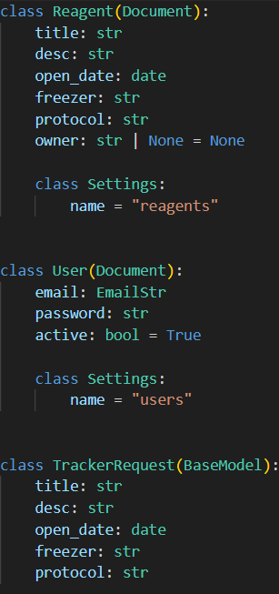
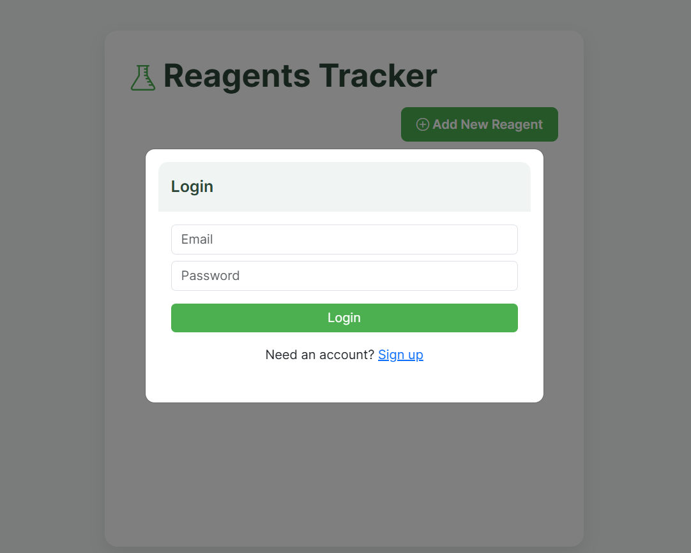
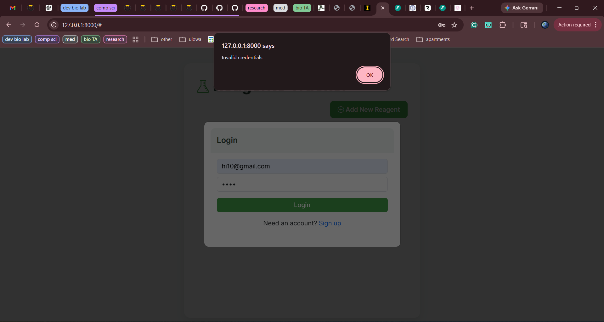
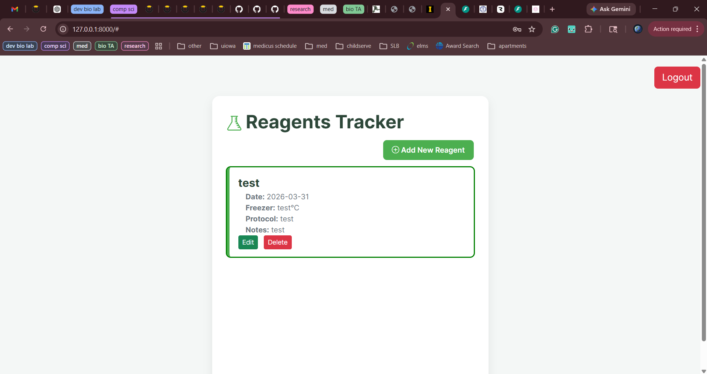
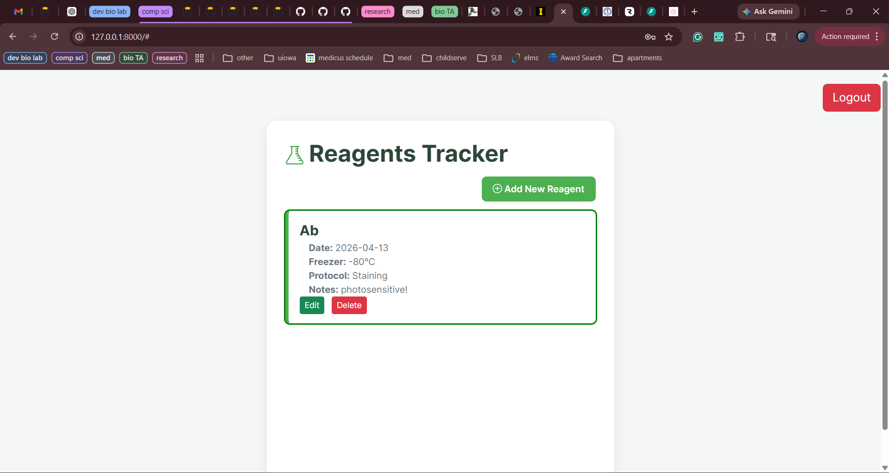
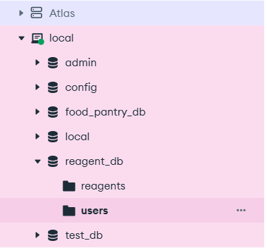
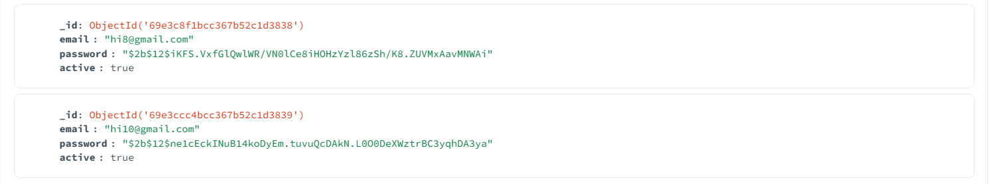

 # Assignment 4: User Login
This assignment was done to further my understanding of using a real database (MongoDB) and implementation of a user login feature on top of my midterm app. 

## Prerequisites and Usage
Packages were installed in a virtual environment, so users must enter the virtual environment to run the files. Outlined below are instructions on how to enter the virtual environment, exit the virtual environment, and run the files through the terminal. 

To enter the virtual environment: ```.\venv\Scripts\activate``` <br>
To exit the virtual environment: ```deactivate```

Install any dependencies needed via the requirements.txt file: ```pip install -r requirements.txt``` <br>

Once in venv, run the app via uvicorn with the following commands:

 ```uvicorn main:app --reload``` <br>

Open the link that is given in the terminal to run the app. 

## MongoDB Connection
This project is connected to MongoDB to store reagent data, rather than using in-memory objects for storage. It is a safer, more secure storage method that is more widely used. 

### Database Connection Strings
To keep sensitive data secure, I created a .env file that contains variables, one of which is the MongoDB connection string. While the .env file would not traditionally get pushed to Git, I did so for the sake of this assignment so you would be able to access the link. 

### Database Models
This assignment contains three models: Reagent, User, and TrackerRequest.

#### Reagent:
Represents a reagent stored in the system. This model is used to define how reagent data is structured and persisted in the database using Beanie. Each reagent includes data such as its name, description, storage location, and associated protocol. It may also be linked to a specific user through the optional owner field, which allows different users to see only their own reagent list. This model corresponds directly to the reagents collection in the database.

#### User:
Represents a registered user of the app. This model is responsible for storing the user’s email and hashed password. The active field indicates whether the user account is currently enabled, to help determine which view users should see. This model maps to the users collection in the database and is used for authentication and access control.

#### TrackerRequest:
Defines the structure of data required when creating or submitting a new reagent through the API. This model is used for request validation and ensures that only the expected fields are accepted. It excludes fields such as owner to help prevent unauthorized access.





## User Login
authentication, handlers, password encryptions, routing, frontend

#### Authentication System
The application uses a token-based authentication system built with JWT, OAuth2, and password hashing via bcrypt. This ensures secure usage.

#### User Signup (/users/signup)

Handles new user registration. It accepts a user’s email and password, checks to see if it already exists. hashes the password using bcrypt, and then saves the new user in the database. This makes sure that passwords are never stored in their original form and prevents the creation of duplicate accounts.

#### User Sign-In (/users/sign-in)

Authenticates users and issues access tokens. Uses OAuth2 form data (username and password), verifies that the user exists and is active, compares the provided password with the stored hashed password, and generates a JWT access token upon successful authentication.

#### Password Hashing (hash_password.py)

Handles secure password storage and verification. Converts a plain text password into a salted bcrypt hash before storing it, and then compares a plaintext password with a stored hashed password. This prevents exposure of sensitive information even if the database is compromised.

#### JWT Token Handling (jwt_handler.py)

Manages creation and validation of authentication tokens. It generates a signed JWT and attaches an expiration timestamp (default: 20 minutes). Then, it also decodes and validates the token, making sure that the token has not expired, and then returns structured token data (TokenData) if valid.

#### Authentication Dependency (authenticate.py)

Protects secured routes by validating access tokens. This extracts the token using OAuth2 Bearer authentication, verifies the token, and rejects requests with missing, invalid, or expired tokens.

#### Application Integration (main.py)

Integrates authentication into the FastAPI application. It also includes other routers such as tracker_routes and user_router and mounts the frontend HTML/CSS/JS files that are used to run the program.

## Code output:

When users open the website, they are first directed to login:



If users enter either the wrong username or password, they are given an alert. They are not told if it is the username or password so as to keep information in the database secure. 


If users are making an account for the first time, they can click "Sign Up." A successful sign up is shown below:


Different users can save different reagents to their dashboard. This is the view for User 1:


And this is the view for User 2. Notice how they have their own saved reagents, that are distinct from User 1:


Further, users are stored in MongoDB as a collection in reagents_db:


And, here is an example of how users are stored in MongoDB. Their hashed passwords are stored for increased security:



